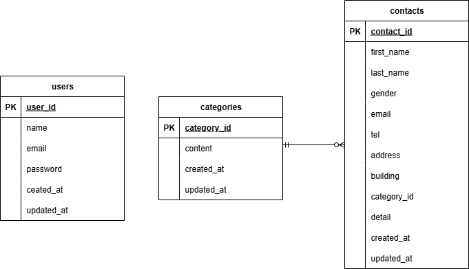

# otoiawase-box

## 環境構築  
Dockerビルド　　
1. git clone git@github.com:misaki-sasaki339/otoiawase-box.git  
2. DockerDesktopアプリを立ち上げる
3. docker-compose up -d --build  
  
＊MySQLは、OSによって起動しない場合があるのでそれぞれのPCに合わせてdocker-compose.ymlファイルを編集してください。  
  
Laravel環境構築
1. docker-compose exec php bash
2. composer install
3. .env.exampleファイルを.envファイルに命名を変更する
4. .envに以下の環境変数を追加する
```
DB_CONNECTION=mysql
DB_HOST=mysql
DB_PORT=3306
DB_DATABASE=laravel_db
DB_USERNAME=laravel_user
DB_PASSWORD=laravel_pass
```
5. php artisan key:generate
6. php artisan migrate
7. php artisan db:seed  
  
## 使用技術
+ PHP 8.1+
+ Laravel 8.x
+ MySQL 8.0+

## ER図


## URL
+ 開発環境：http://localhost/
+ phpMyAdmin：http://localhost:8080/